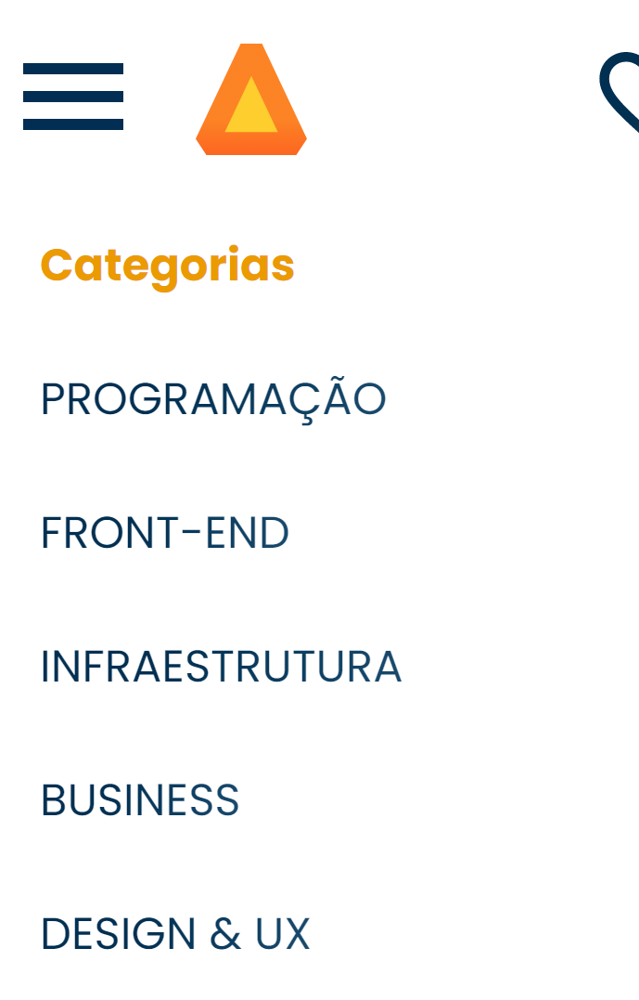
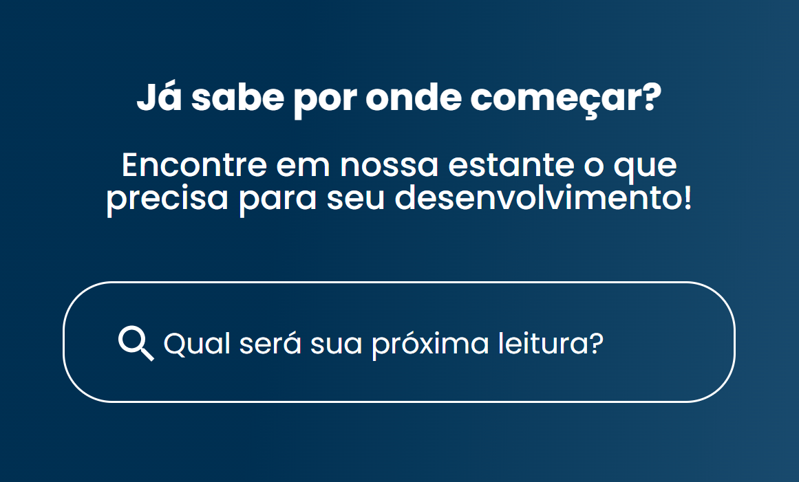
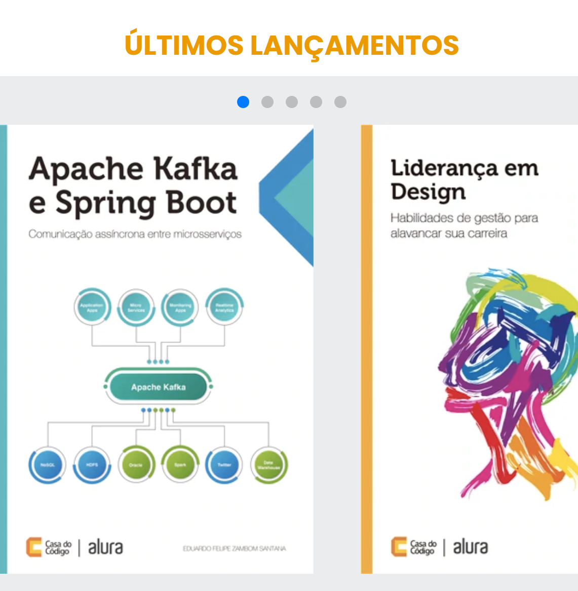
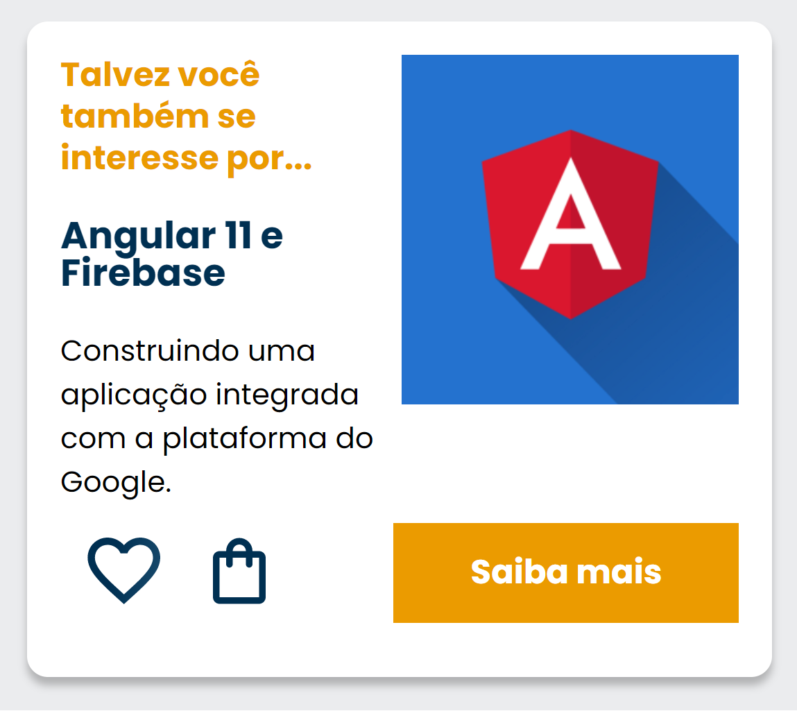
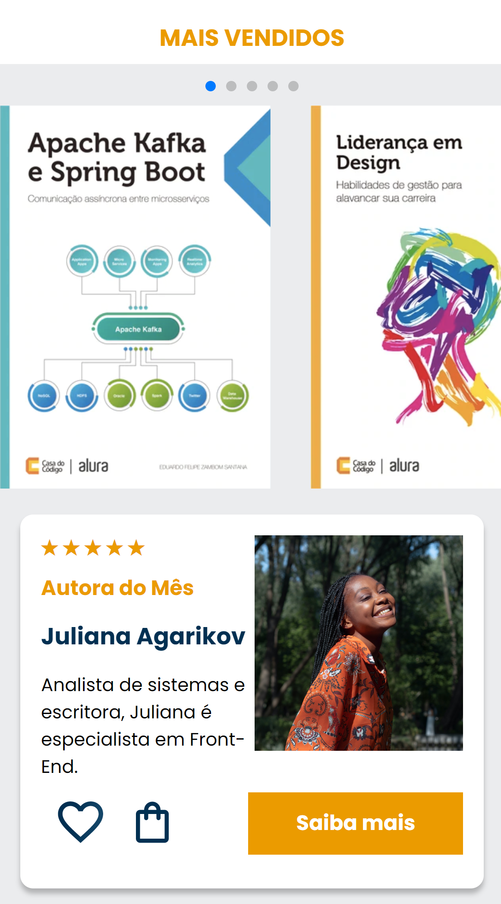
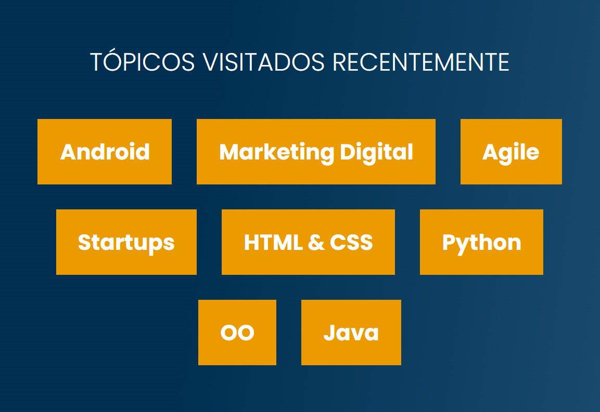
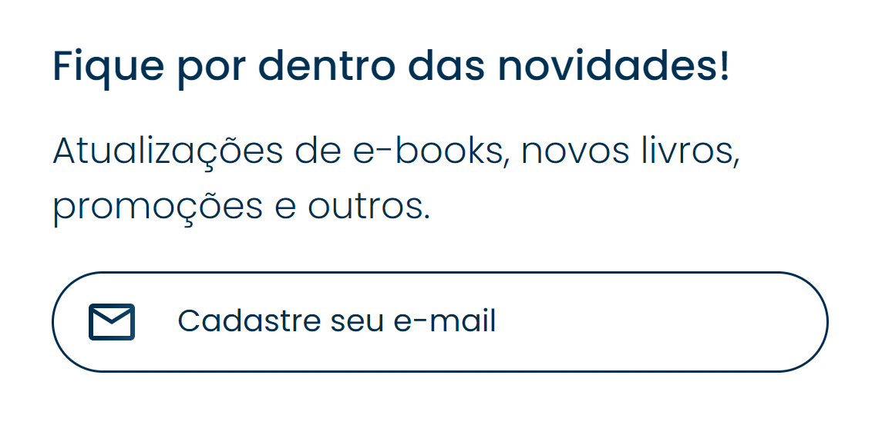
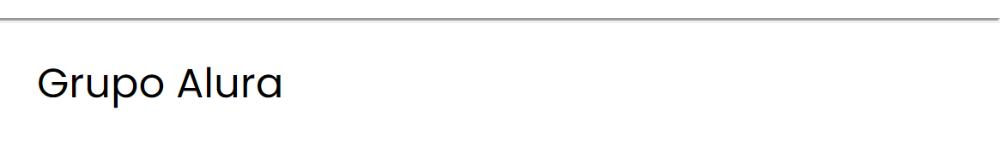

# AluraBooks
## Progressão do Projeto

### Navegador

### Menu Hamburguer

### Banner

### Carrossel

### Card

### Reutilização de Estilos

### Tópicos

### Contatos

### Rodapé

### Projeto Finalizado

